# NVFP4-DiT: Efficient 4-Bit Audio-Guided Video Diffusion Transformers for Low-Cost Video Generation

Official implementation of **NVFP4-DiT**, a low-precision framework for training and deploying **audio-guided text-to-video diffusion transformers** entirely in **4-bit floating-point precision (NVIDIA NVFP4 / E2M1)**.

> **Md Rakibul Islam Raihan** (School of Software) and **Peng Zhang** (School of Computer Science), Northwestern Polytechnical University, Xi'an, China.

NVFP4-DiT combines (i) a theoretical analysis of FP4 diffusion under block-wise scaling with a sufficient condition for temporal coherence, (ii) **adaptive block-wise quantization** and **quantization-aware training (QAT)** with learnable per-head scales for cross-modal attention, and (iii) **custom Triton kernels** for FP4-packed matrix multiplication and attention plus a vLLM-style serving scheduler. Experiments on WebVid-10M, VGGSound, and UCF-101 show that 4-bit training retains competitive multimodal quality while substantially cutting memory, latency, and energy.

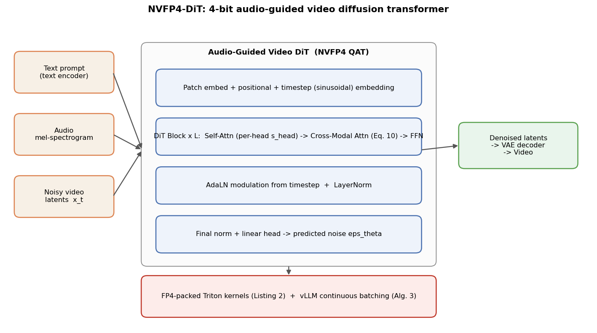

---

## Highlights

| Method | Precision | FVD ↓ | SyncNet ↑ | Memory | Throughput | Energy |
|--------|-----------|-------|------------|--------|------------|--------|
| BF16 baseline | BF16 | 98.3 | 0.892 | 28.5 GB | 0.31 vid/s | 892 J |
| FP8 | FP8 | 100.1 | 0.885 | 14.3 GB | 0.67 vid/s | 412 J |
| INT8 | INT8 | 105.7 | 0.871 | 12.1 GB | 0.72 vid/s | 384 J |
| Static FP4 | FP4 | 187.3 | 0.723 | — | — | — |
| **NVFP4-DiT (ours)** | **FP4** | **99.2** | **0.886** | **6.8 GB** | **1.05 vid/s** | **285 J** |

- **0.9% FVD degradation** vs. BF16 (99.2 vs. 98.3); SyncNet drops only **0.7%**.
- **3.4× throughput**, **3.4× lower latency**, **76.3% memory reduction**, **68% energy reduction**.
- Static FP4 collapses (FVD 187.3) — QAT is essential.

---

## Methodology

### 1. Theoretical foundations

**NVFP4 quantization (Definition III.1).** For a value `v` with block scale `s`:

```
Q_FP4(v; s) = s * clip( round(v / s)_FP4 , -6, 6 )
```

NVFP4 is E2M1 (1 sign, 2 exponent, 1 mantissa bits); the representable magnitudes are `{0.5, 0.75, 1, 1.5, 2, 3, 4, 6}`, clipped to `[-6, 6]` in the scaled domain. With block-wise scaling, the relative quantization error is bounded by `ε_FP4 = 2^-3 = 0.125` (Lemma III.2).

**Convergence of FP4-diffusion (Theorem III.3).** Under Lipschitz continuity, bounded gradients, and a smooth noise schedule, the reverse-process error satisfies

```
E[‖x0 − x̂0‖²] ≤ (C / T) Σ_t ( ε_FP4² · E[‖∇ log p(x_t)‖²] + σ_t² )
```

so for `T ≥ 1000` the FP4 error approaches FP16 up to a factor of `(1 + O(ε_FP4))`.

**Temporal coherence (Theorem III.6).** The coherence error is bounded by `Δ_temp ≤ (2ε_FP4 / (1 − ε_FP4))·‖μ‖₂ + δ_t`, with sufficient condition `‖ΔQKᵀ‖_F ≤ δ_t · ‖μ‖₂`. This guides allocating higher precision to attention heads with large temporal gradients.

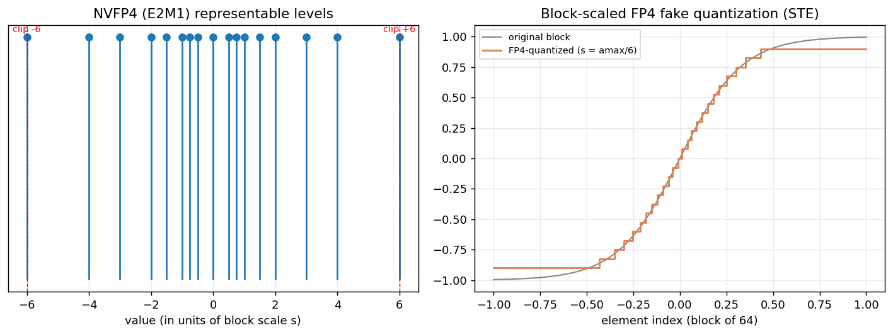

### 2. Algorithmic framework

**Adaptive block-wise quantization (Algorithm 1, Eq. 9).** Block size is selected per layer:

```
BlockSize(l) = argmin_{b ∈ {1,2,4,8,16,32,64}}  [ Error(l, b) + λ · Memory(b) / Memory_max ]
```

**QAT for cross-modal attention (Eq. 10).** Learnable per-head scale factors `s_head` (initialized to 1) reshape the attention logits:

```
Attention(Q, K, V) = softmax( QKᵀ / √d_k + log(s_head) ) · V
```

**Combined loss (Eq. 11):**

```
L_total = L_diffusion  +  λ_sync · L_sync(SyncNet)  +  λ_temp · ‖x_t − x_{t-1}‖_F²
```

with `λ_sync = 0.1`, `λ_temp = 0.01` (Table XV). A straight-through estimator (STE) lets gradients flow through the fake-quantize op during QAT.

### 3. Systems optimization

- **FP4-packed Triton kernels (Listing 2):** two FP4 values per byte, on-the-fly dequantization, FP32 accumulation → 2.1× over naive FP4, 3.2× over FP16, 4× memory reduction.
- **vLLM-style serving (Algorithm 3):** frame-level paged attention, dynamic frame batching, and speculative frame decoding for variable-length video generation.

---

## Results

### Quality on WebVid-10M (Table II)
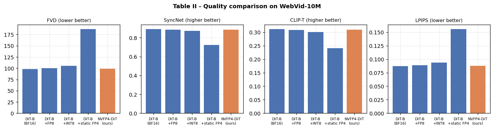

### Quality & memory across architectures (Table III)
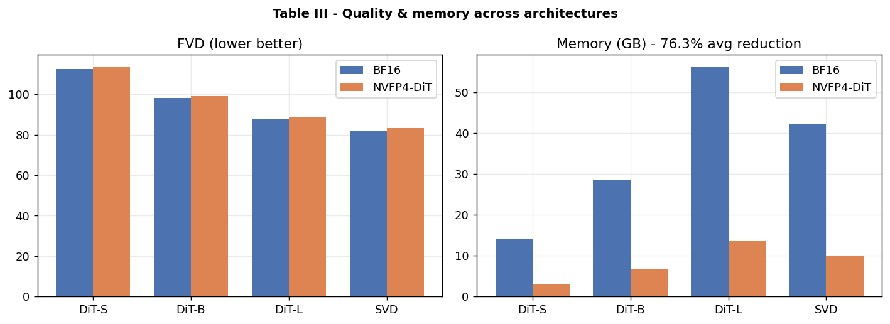

### Inference performance (Table IV)
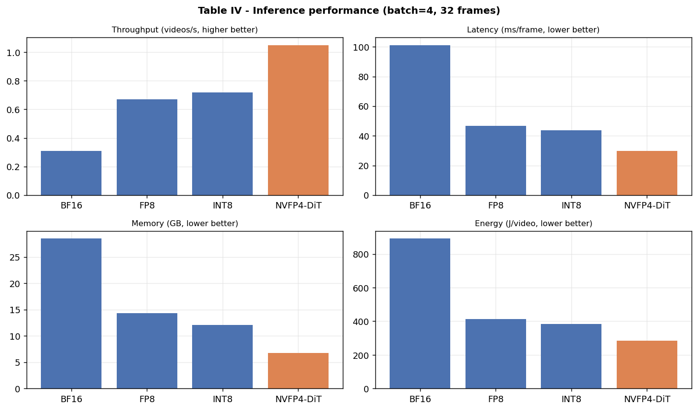

### Audio-visual sync under noise (Table V)
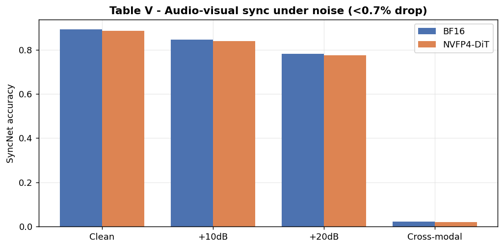

### Training cost (Table VI)
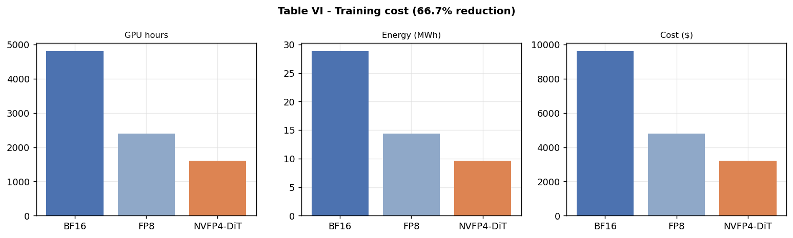

### Inference latency breakdown (Table XIV)
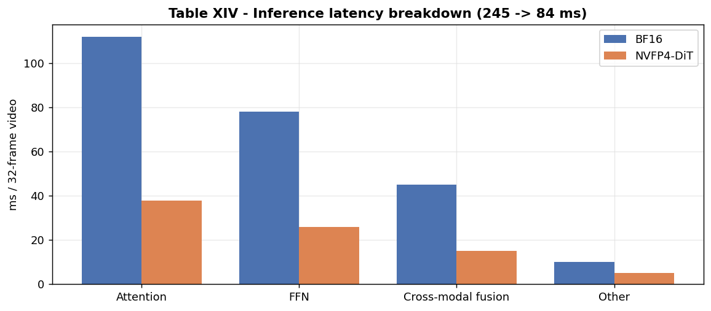

---

## Ablation studies

### Effect of FP4 block size (Table VII)
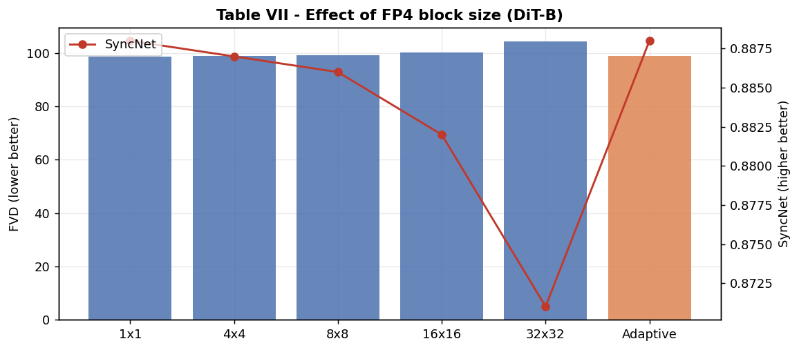

### Impact of QAT components (Table VIII)
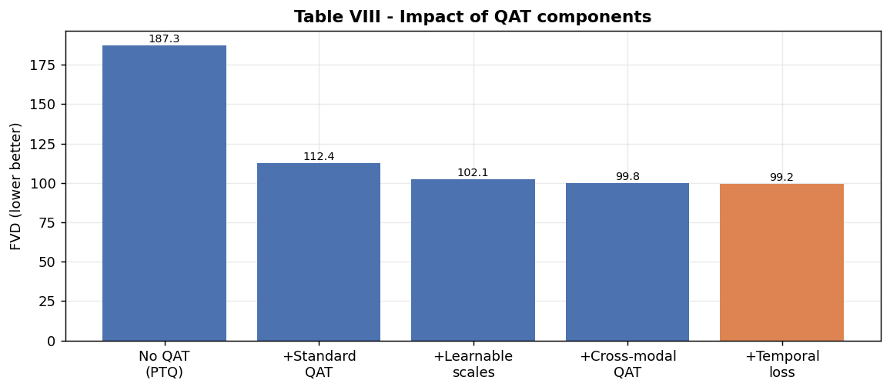

### Kernel microbenchmarks (Table IX)
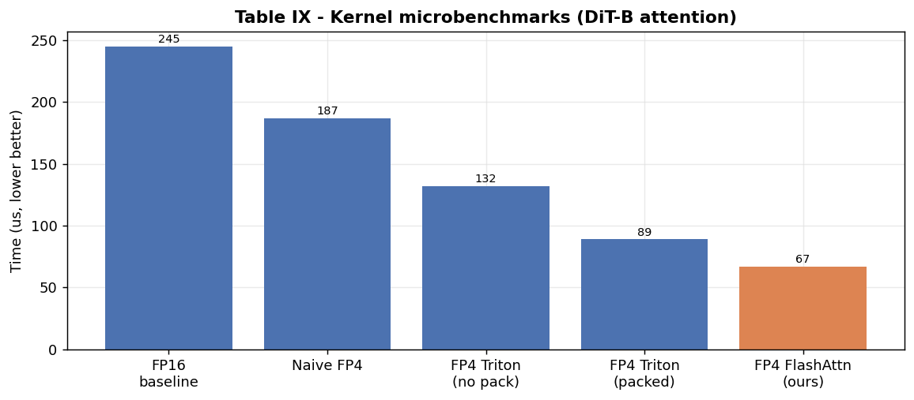

### Cross-dataset generalization (Table X)
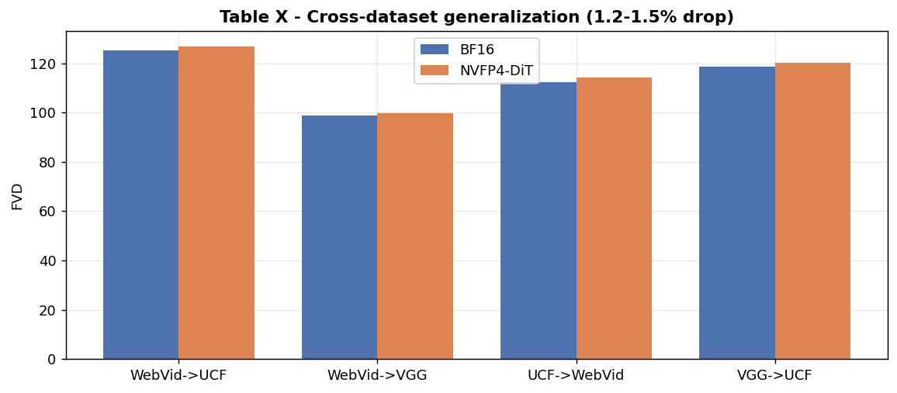

### Robustness to H.264 compression (Table XI)
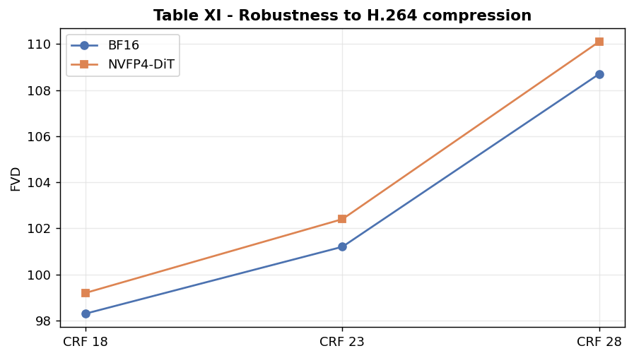

### Robustness to resolution scaling (Table XII)
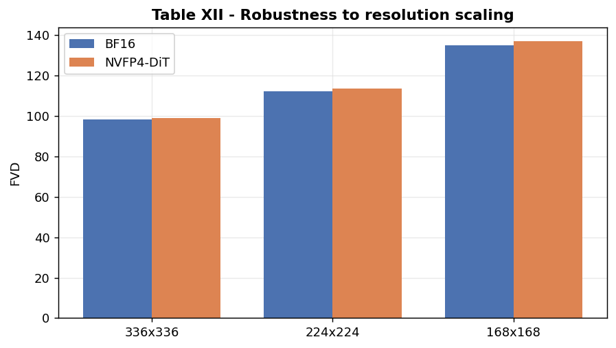

### User preference study (Table XIII)
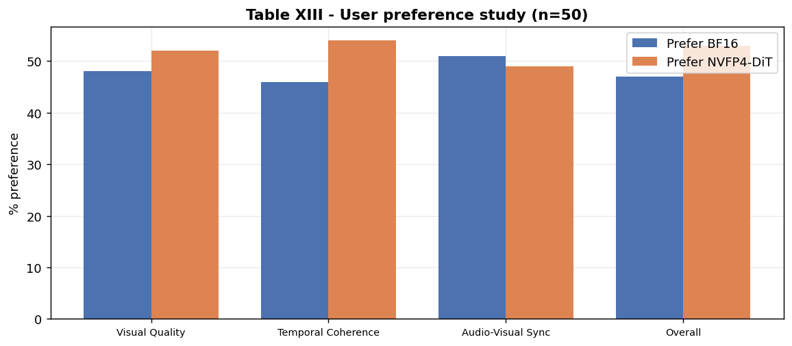

---

## Quick start

```bash
git clone https://github.com/theraihanrakibb/NVFP4-DiT.git
cd NVFP4-DiT
pip install -r code/requirements.txt
```

### Train (smoke test on synthetic latents)

```bash
cd code
python train.py --config configs/dit_s.yaml
```

### Sample from a checkpoint

```bash
python inference.py --config configs/dit_s.yaml \
    --checkpoint checkpoints/last.pt --use_ema \
    --out ../results/sample_videos/gen.pt
```

### Regenerate all paper figures

```bash
python code/make_figures.py   # writes images/*.png
```

### Training flags

| Flag | Effect |
|------|--------|
| `--epochs N` | Override `train.epochs`. |
| `--dataset-samples N` | Override synthetic dataset size (default 256). |
| `--syncnet-path PATH` | Load a pretrained SyncNet to enable the synchronization loss (Eq. 11). |

### Config knobs (`code/configs/*.yaml`)

| Key | Description |
|-----|-------------|
| `train.use_fp4_qat` | Wrap every `nn.Linear` in `FP4Linear` (NVFP4 E2M1 QAT). |
| `train.fp4_block_size` | Fixed block size when `adaptive_block_size` is false. |
| `train.adaptive_block_size` | Pick a per-layer block size via Algorithm 1 / Eq. (9). |
| `train.loss.lambda_sync` / `lambda_temp` | Weights for the sync and temporal-smoothness terms (Table XV: 0.1 / 0.01). |
| `train.loss.use_sync` | Enable the sync term (also needs `--syncnet-path`). |
| `train.loss.use_temp` | Enable the temporal-coherence regularizer (Theorem III.6). |
| `diffusion.schedule` | `cosine` (paper default, Table XV) or `linear`. |

### Model configs

| Config | Hidden | Depth | Heads | Frames | Resolution | Audio dim |
|--------|--------|-------|-------|--------|------------|-----------|
| `dit_s` | 384 | 6 | 6 | 8 | 32×32 | 128 |
| `dit_b` | 768 | 12 | 12 | 16 | 42×42 | 256 |
| `dit_l` | 1024 | 24 | 16 | 16 | 48×48 | 256 |

The paper's DiT-B reference (Table XVI) is 12 layers, hidden 768, 12 heads, MLP ratio 4.0, patch 2×2, 16 frames at 336×336.

---

## Code → paper map

| File | Implements |
|------|------------|
| `code/quantization.py` | NVFP4 (E2M1) block-scaled fake quantization + STE (Definition III.1, Listing 1); adaptive block-size selection (Algorithm 1, Eq. 9); `FP4Linear` QAT wrapper. |
| `code/model.py` | `CrossModalAttention` with learnable per-head scales `softmax(QKᵀ/√d_k + log s_head)·V` (Eq. 10); per-head scales in self-attention for temporal coherence (Theorem III.6). |
| `code/kernels.py` | FP4-packed matmul with on-the-fly dequant (Listing 2); Triton path when `NVFP4_USE_TRITON=1` on CUDA, PyTorch fallback otherwise. |
| `code/syncnet.py` | Pluggable `SyncNet` / `SyncLoss` for the synchronization term of Eq. (11). |
| `code/train.py` | DDPM training, EMA, cosine schedule (Table XV), combined loss (Eq. 11) with sync + temporal terms. |
| `code/inference.py` | DDPM-style sampling from a checkpoint. |
| `code/make_figures.py` | Reproducibly regenerates all `images/*.png` from the paper's tables. |

---

## Repository layout

```
NVFP4-DiT/
├── code/                # PyTorch training, QAT, kernels, inference, figure script
│   ├── configs/         # dit_s / dit_b / dit_l YAML configs
│   ├── model.py
│   ├── quantization.py
│   ├── kernels.py
│   ├── syncnet.py
│   ├── train.py
│   ├── inference.py
│   └── make_figures.py
├── images/              # All paper figures (regeneratable via code/make_figures.py)
├── paper/               # IEEEtran LaTeX sources + PDFs (main + appendix)
├── results/             # Sample outputs and training logs
├── README.md
└── LICENSE
```

---

## Datasets, hardware, and metrics

- **Datasets:** WebVid-10M (10M clips, 336×336), VGGSound (200k clips, 224×224), UCF-101 (13k videos, 320×240).
- **Hardware:** 8× NVIDIA H100 (80 GB) for training; 1× H100 for inference benchmarks.
- **Baselines:** BF16, FP8 (E4M3) + QAT, INT8 + SmoothQuant, static FP4.
- **Metrics:** FVD, SyncNet accuracy, CLIP-T, LPIPS, throughput, latency, memory, energy.

---

## Limitations

- QAT adds ~20% overhead per step vs. BF16, but total training is ~66% shorter due to FP4 acceleration.
- NVFP4 tensor cores are only available on H100/B200 (not Ada/Ampere).
- Long video generation (>128 frames) can accumulate quantization error; hierarchical quantization is future work.
- Theoretical bounds are worst-case; practical degradation is <1%.

---

## Citation

If you use this work, please cite:

```bibtex
@article{raihan2026nvfp4dit,
  title   = {NVFP4-DiT: Efficient 4-Bit Audio-Guided Video Diffusion Transformers for Low-Cost Video Generation},
  author  = {Raihan, Md Rakibul Islam and Zhang, Peng},
  year    = {2026},
  note    = {Northwestern Polytechnical University}
}
```

## License

[MIT](LICENSE). Code, kernels, and related artifacts are released for research purposes.
